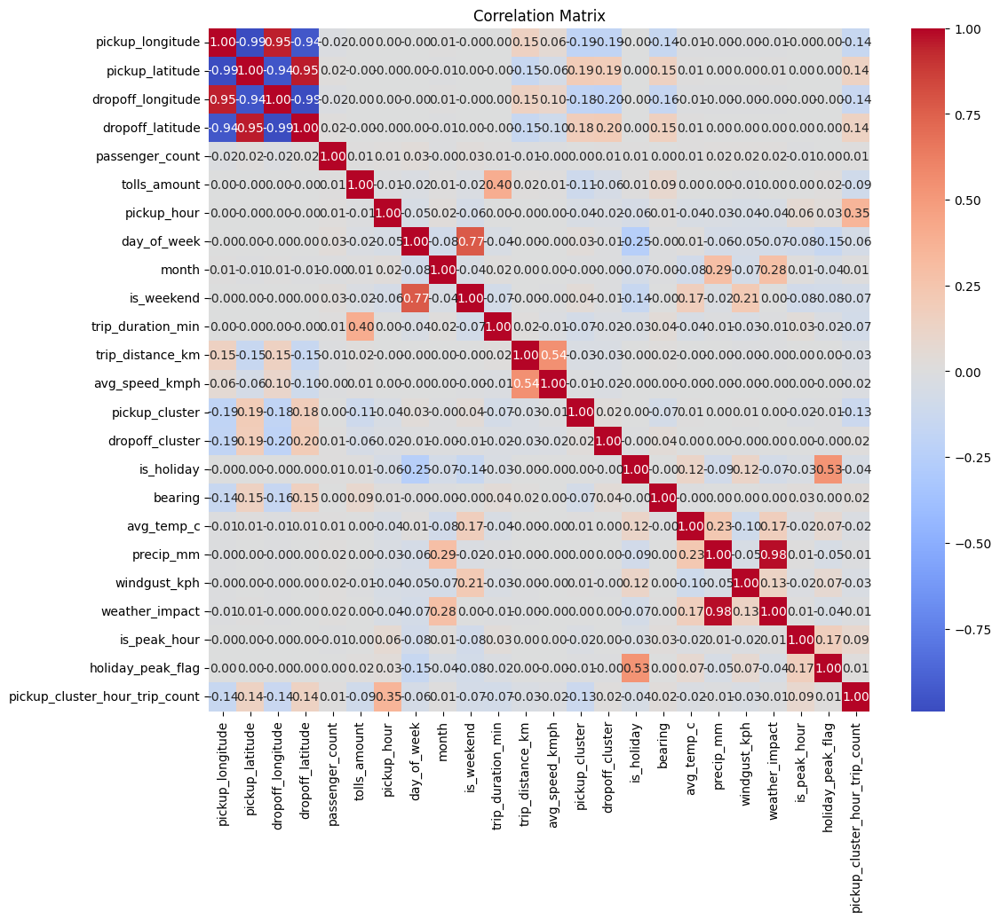
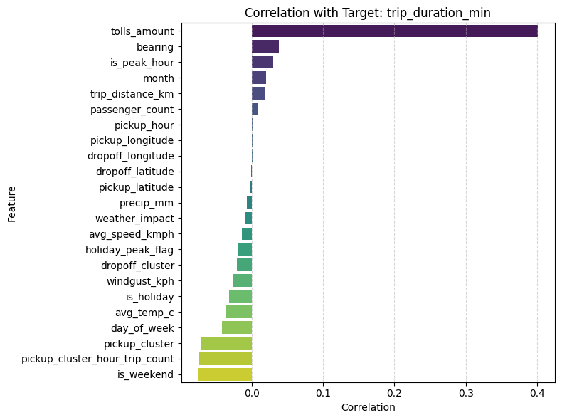
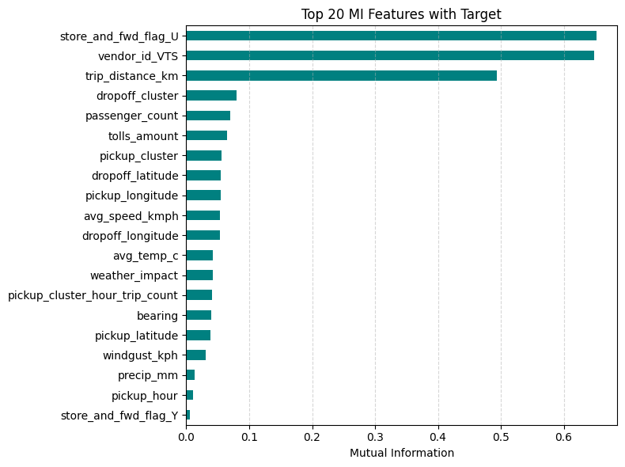

# 🚖 NYC Taxi Trip Duration Prediction

A machine learning project to predict taxi trip durations in NYC using spatial, temporal, and weather-based features.


---

## 📌 Project Overview


| **Key Element**     | **Description**                                                                 |
|---------------------|---------------------------------------------------------------------------------|
| **Dataset**         | New York City Taxi Trip Data (2014) |
| **Sample Used**     | 200,000 records for development; full 15M records used for final evaluation    |
| **Target Variable** | Trip Duration (minutes)   |
| **Best Model**      | XGBoost Regressor    |
| **Final MAE**       | 2.89 minutes   |
| **R² Score**        | 0.71      |

---

## 🧠 Summary

This project builds a regression model to predict taxi trip time using real NYC data from 2014. After advanced feature engineering—including spatial, temporal, weather, and clustering features—the final XGBoost model achieved **MAE of 2.89 minutes** and **R² = 0.71**.

---

## 🗃️ Data Sources

- **NYC Taxi Trip Data (2014)**  
  > Over 15 million trip records (sampled down to 200,000 for speed)  
  🔗 [Kaggle Dataset](https://www.kaggle.com/datasets/kentonnlp/2014-new-york-city-taxi-trips)  
  ⚠️ *Due to size limitations, this file is not included in the repo. Please download it manually.*

- **NYC Daily Weather (via VisualCrossing API)**  
  > Includes `avg_temp_c`, `precip_mm`, `windgust_kph`, etc.  
  > Generated by running the included `fetch_weather_data.ipynb` notebook.

---

## 🛠️ Feature Engineering

Extracted and engineered multiple types of features to help the model capture trip patterns:

### 🔸 Temporal Features
- `pickup_hour`, `day_of_week`, `month`, `is_weekend`
- `is_peak_hour` for rush hour detection
- `holiday_peak_flag`: intersection of peak hour & holiday

### 🔸 Spatial Features
- `trip_distance_km`: Haversine distance between pickup/dropoff coordinates
- `bearing`: direction of travel
- `pickup_cluster`, `dropoff_cluster`:  Created using **KMeans clustering** (k=50) on latitude/longitude to identify high-traffic zones

### 🔸 Interaction Features
- `pickup_cluster_hour_trip_count`: number of trips in each cluster per hour, modeling traffic density

### 🔸 Weather Features
- `weather_impact`: weighted composite of precipitation, wind gust, and temperature

### 📊 Feature Distribution

- 

### 🔗 Correlation & Feature Relationships

- **Feature Heatmap**:
  

- **Feature vs Target Correlation**:
  

- **Mutual Information**:

  


---

## 🧪 Modeling Workflow

- Tested multiple regression models:
  - Linear Regression ❌
  - SVR, KNN ❌
  - Decision Tree 🔸
  - Random Forest ✅
  - XGBoost ✅✅ (Best model)

### ✅ Final Model: XGBoost Regressor

> Tuned hyperparameters:

```python
{
    "colsample_bytree": 0.7,
    "learning_rate": 0.05,
    "max_depth": 10,
    "n_estimators": 250,
    "subsample": 0.9
}
````

---

## 📈 Evaluation

| Metric | Value        |
| ------ | ------------ |
| MAE    | 2.89 minutes |
| R²     | 0.71         |

### 🔍 Insights

* **Top features** (Permutation + Feature Importance):

  * `trip_distance_km`
  * `pickup_hour`
  * `is_weekend`
  * `pickup_cluster_hour_trip_count`
* **Weather features** had limited impact due to daily granularity.

### 🔧 Error Behavior

* Model tends to **under-predict** trip durations in \~85% of high-error cases.
* Mean error near zero indicates no systematic bias.
* High errors often relate to zero-distance or noisy data.

> 
> 

---

## 🚀 Quick Start

```bash
# Clone the repository
git clone https://github.com/YOUR_USERNAME/nyc-taxi-trip-prediction.git
cd nyc-taxi-trip-prediction

# Install dependencies
pip install -r requirements.txt

# Run the main notebook
jupyter notebook trip_duration_prediction.ipynb

```

> ⚠️ **Important:**
> Before running the notebooks:
> * Download `nyc_taxi_data_2014.csv` from [Kaggle](https://www.kaggle.com/datasets/kentonnlp/2014-new-york-city-taxi-trips)
> * Run `fetch_weather_data.ipynb` once to generate `weather_nyc_2014.csv`


---

## 📂 Project Structure

```bash
nyc-taxi-trip-prediction/
├── nyc_taxi_data_2014.csv
├── weather_nyc_2014.csv
├── trip_duration_prediction.ipynb
├── fetch_weather_data.ipynb
├── assets/ #images used in README
├── .gitignore
├── requirements.txt
└── README.md
```

---

## خلاصه پروژه

این پروژه با هدف پیش‌بینی زمان سفر تاکسی‌های نیویورک انجام شده است.
داده‌های اصلی شامل سفرها و آب‌وهوا در سال ۲۰۱۴ می‌باشند.
پس از مهندسی فیچرهای زمانی، مکانی (شامل خوشه‌بندی زون‌ها)، و آب‌وهوایی،
مدل XGBoost با خطای میانگین ۲.۸۹ دقیقه عملکرد مناسبی دارد.
عوامل کلیدی در پیش‌بینی شامل مسافت سفر، ساعت حرکت، تعطیلات، و تعداد سفرها در زون-ساعت می‌باشد.

---


